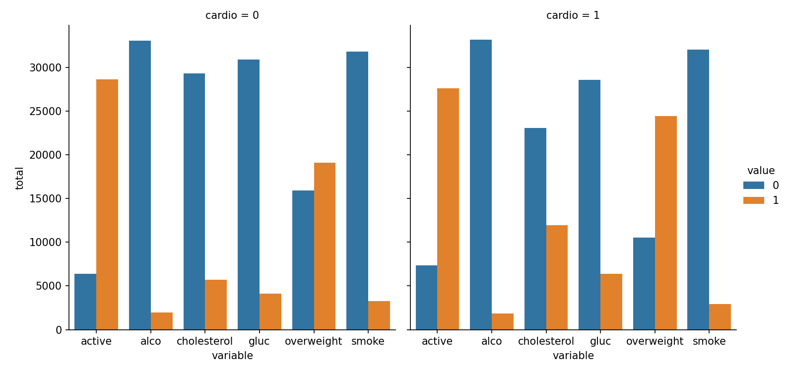
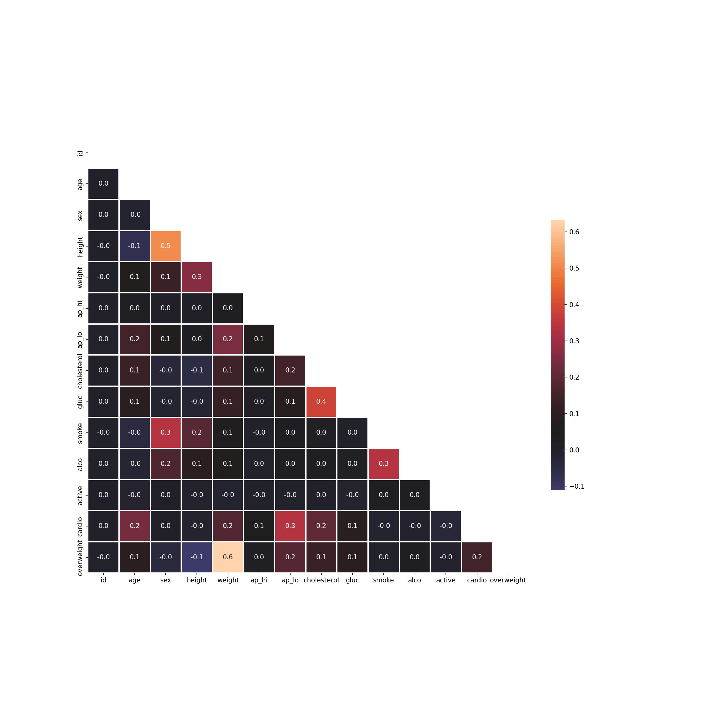
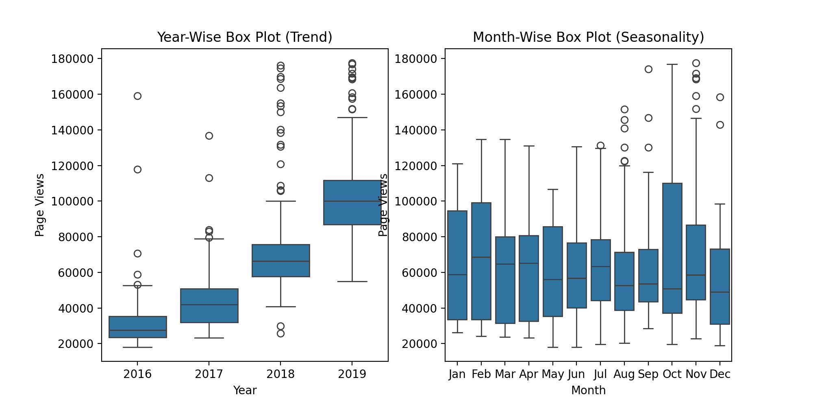
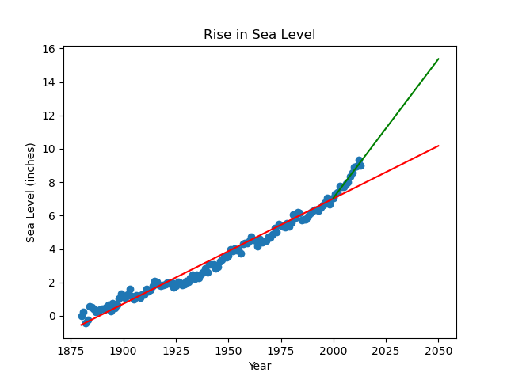

# 5 Python Data Projects for Data Analysis with Python Certification

## 1: Mean-Variance-Standard Deviation Calculator

## 2: Demographic Data Analyzer

## 3: Medical Data Visualizer

## 4: Page View Time Series Visualizer

## 5: Sea Level Predictor

