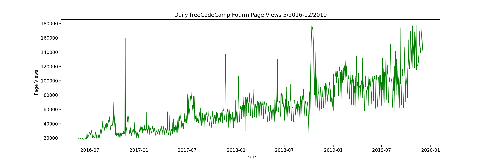
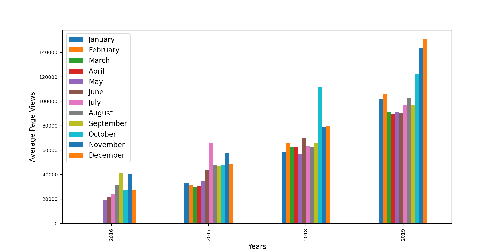

# FreeCodeCamp: 5 Python Data Projects for Data Analysis with Python Certification

## 1: Mean-Variance-Standard Deviation Calculator

The goal of this project was to convert a 9-character Python string into a 3x6 Numpy array of mathematical calculations. I took a unique approach, first converting the 1x9 python list into a 3x3 Numpy array.
[Image]
Next, I found the locations of all the values for performing the calculations. This was pretty straightforward. I created a variable for each value in the final array, specifying the rows and columns for each calculation.
[image]
Finally, I just needed to format the output. This included the names of the calculations I performed and the variables I had set earlier to display the resulting calculations in the 3x6 array. 
[Image]
(Mean-Variance-Standard Deviation Calculator Code [Hyperlink to code])

## 2: Demographic Data Analyzer

My next project involved loading a CSV into Python using the Pandas library to perform a wide variety of calculations on a demographic dataset. 
[Imgage]
Examples of calculations this project required were: average male age, percentage of people with advanced education, and percentage earning a salary threshold of $50,000 annually with and without education. 
[Image]
My approach to this problem was to assign a variable to perform the calculation and set that variable equal to the variable given by the problem's author. This helped me read and understand the calculations I was performing, and keep a clean and consistent aesthetic to the code.
[image]
 (Demographic Data Analyzer Code)

## 3: Medical Data Visualizer

This project introduced Data Visualization using Matplotlib and Seaborn libraries, visualizing biometric results to explore the relationship of multiple variables including  cardiac disease, blood markers, and lifestyle choices.

The first step was to import the data and add an 'overweight' metric using a basic BMI calculation based on individual weight and height. This was followed by normalizing the cholesterol and glucose levels to normal or high.

[image]

Now that the data is formatted correctly, I need to draw the first graph, a cat plot. I first added the metrics needed to be plotted, then I used the .groupby() function to compare those who perform cardio exercise regularly and those who do not. Then the Seaborn plot is called to display the graph.

For the heat map, the author wants the data cleaned first. to perform this the bottom 2.5% and top 97.5% of height values will be removed for an accurate result.

[image]

Before the heat map can be displayed, a couple of values need to be assigned. This includes the correlation method and a mask. Afterwards the Seaborn heatmap() function can be called, displaying the heat map.

(Medical Data Visualizer Code) [link]

## 4: Page View Time Series Visualizer
For this project, I am given data on page views in a CSV for the FreeCodeCamp website including daily visit numbers. First I import the CSV and clean the data removing the same 2.5% and 97.5% quantile from the dataset. 
[image]
Next, I draw a line plot. This is very straightforward using Matplotlib. I simply call the function import the dataframe, and set the correct labeling.
image[]

The second plot required is a bar plot. This will group each year and display a bar for the average daily views each month. I do this with the 'groupby()' function, and then I call the 'bar.plot()' function and list the months as the legend.

[Image]

Finally, there needs to be a box plot containing 2 graphs. One that shows the trend by drawing a box and whiskers for each year, and one that has a box and whiskers for the 12 months. I do this by setting the month number to the correlated name and drawing the boxplots on 2 different axes. The year plot is 'axis[0]' and the monthly is 'axis[1]'.

[image]

## 5: Time View Sea Level Predictor

